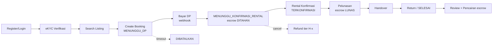

# Laporan Review — `backend-driveo`

**Lingkup:** seluruh `app/`, `seed.py`, `alembic/`, `tests/`, plan di `docs/superpowers/plans/`.
**Stack:** FastAPI 0.142 · SQLAlchemy 2.1 async · Pydantic v2 · SQLite in-memory · PyJWT · passlib/bcrypt.
**Metode:** baca seluruh kode (~1.600 LOC), jalankan test suite (**31 passed**), dan jalankan smoke test HTTP ([smoke.py](file:///home/royyy/.gemini/antigravity-cli/brain/e2fcfcbb-a2ff-48fd-adf4-53337ed2c8ec/scratch/smoke.py)) untuk membuktikan temuan.

> [!CAUTION]
> **Verdict: BELUM layak demo/produksi.** Endpoint inti `POST /bookings` **selalu error 500**, sehingga seluruh alur bisnis (booking → bayar → konfirmasi → selesai → review) terputus sejak langkah pertama. Ditambah ada beberapa celah keamanan kritis (siapa pun bisa jadi Admin, siapa pun bisa menandai booking “lunas”).

---

## 1. Ringkasan Eksekutif

| Severity | Jumlah | Contoh |
|---|---|---|
| 🔴 Critical | 7 | Booking selalu 500, self-register Admin, JWT secret hardcoded, webhook payment tanpa auth, IDOR cancel |
| 🟠 High | 11 | Harga ditentukan client, auto-cancel tidak melepas kalender, race double-booking, state machine tidak lengkap |
| 🟡 Medium | 12 | Format respons/error tidak konsisten, tanpa pagination, float untuk uang, tanpa FK |
| 🔵 Low | 8 | Penamaan campur ID/EN, deprecated API, typo kolom |

**Hasil smoke test (bukti):**

| # | Skenario | Hasil | Seharusnya |
|---|---|---|---|
| 1 | Register dengan `role_name: "Admin"` | Token ber-role **Admin** | 400/403 |
| 2 | Register email duplikat | **500** | 409 |
| 3 | `POST /bookings` payload valid | **500** (`TypeError: 'promo_code' is an invalid keyword argument for Booking`) | 201 |
| 5 | `POST /payments/webhook` tanpa auth, 2× | 200, 200 (escrow tercatat ganda) | 401 + idempoten |
| 6 | `GET /notifications/inbox/{email}` tanpa auth | 200 | 401 |
| 7 | `POST /availability` | 200 `null` (stub kosong) | Implementasi / 501 |
| 8 | Review rating=999 untuk booking yang tidak ada | 200 | 422/404 |
| 9 | Verifikasi rental `status: "TERSERAH"` | 200 | 422 |
| 10 | Rental user lain tambah kendaraan ke rental orang lain, tarif −5 | 201 | 403/422 |
| 11 | Penyewa buat listing untuk kendaraan fiktif | 201 | 403/404 |

---

## 2. Kesinambungan Alur Bisnis (Continuity)

Alur yang diharapkan (dari plan Dev A/B):

Status implementasi nyata:

| Langkah | Status | Masalah |
|---|---|---|
| Register/Login | ⚠️ Ada | Role bebas dipilih, tidak ada refresh token, `is_active` tidak dicek |
| eKYC | ⚠️ Stub | OCR hardcoded “Budi Santoso”; status tidak pernah berubah; **tidak dipakai sebagai syarat booking** |
| Search | ⚠️ Minim | Tanpa filter tanggal/ketersediaan, lokasi, sort, pagination |
| Create booking | ❌ **Rusak** | Selalu 500 (lihat C1) |
| Bayar DP | ⚠️ | `/payments/simulate` membayar `sisa`, bukan `dp`; transisi DP vs pelunasan tidak dibedakan |
| Konfirmasi rental | ❌ Tidak ada | Tidak ada endpoint, state `TERKONFIRMASI` tidak pernah dipakai |
| Pelunasan / `LUNAS` | ❌ Tidak ada | `LUNAS` hanya ada di mock |
| Handover / Return | ❌ Tidak ada | Tabel checklist tidak ada |
| `SELESAI` | ❌ Tidak ada | Akibatnya aturan review “hanya saat SELESAI” mustahil dipenuhi |
| Review | ⚠️ | Tanpa validasi apa pun |
| Cancel + refund | ⚠️ | `calculate_refund_amount`, model `Refund`, `RefundPort` **tidak pernah dipanggil** |
| Escrow release | ❌ Tidak ada | `EscrowLedger` hanya pernah di-insert “DITAHAN” |
| Auto-cancel DP | ⚠️ | Tidak melepas slot kalender (lihat H2) |
| SLA auto-cancel konfirmasi | ❌ Tidak ada | |
| Notifikasi | ⚠️ | `NotificationService` tidak pernah dipanggil dari alur mana pun |
| Audit log | ⚠️ | Model `AuditLog` tidak dipakai; hanya `MockAuditPort.print()` di 1 endpoint |

> [!IMPORTANT]
> `.superpowers/sdd/*/progress.md` menandai **semua 26 task “complete”**, sementara [todo.md](file:///home/royyy/Projects/backend-driveo/tasks/todo.md) semuanya `[ ]`. Banyak task “complete” (9 Availability, 14 Confirmation, 16 Handover, 18 Dashboard, 19 Expose Ports) faktanya tidak diimplementasikan — test yang dipakai sebagai bukti hanyalah test model yang sama berulang (mis. Task 8/9/10 semua memakai `test_vehicle.py`).

---

## 3. Temuan Critical 🔴

### C1. `POST /bookings` selalu 500
[booking/routers.py:L62](file:///home/royyy/Projects/backend-driveo/app/modules/booking/routers.py#L62) — `Booking(user_id=..., **req.dict())` ikut mengirim `promo_code`, padahal `Booking` tidak punya kolom tersebut. Selain itu `db.add(avail)` sudah dijalankan sebelumnya, jadi slot ikut ter-rollback — tapi user tetap mendapat 500.
**Fix:** `req.model_dump(exclude={"promo_code"})` + simpan `promo_id`/`discount` di kolom tersendiri. Tambah test API untuk endpoint ini (test saat ini hanya menguji model langsung, jadi bug lolos).

### C2. Privilege escalation via register
[auth/routers.py:L23-L35](file:///home/royyy/Projects/backend-driveo/app/modules/auth/routers.py#L23-L35) — `role_name` bebas, dan role baru **dibuat otomatis** bila belum ada. Siapa pun bisa mendaftar sebagai `Admin`.
**Fix:** whitelist (`Penyewa` saja untuk self-register; `Rental` didapat lewat onboarding; `Admin` hanya via seed/CLI). Jangan auto-create role.

### C3. JWT secret hardcoded & diduplikasi
`SECRET_KEY = "test_secret_key"` di [auth/dependencies.py:L6](file:///home/royyy/Projects/backend-driveo/app/modules/auth/dependencies.py#L6) **dan** [auth/routers.py:L14](file:///home/royyy/Projects/backend-driveo/app/modules/auth/routers.py#L14). Siapa pun yang membaca repo bisa memalsukan token Admin. Kunci 15 byte (PyJWT sudah memberi `InsecureKeyLengthWarning`).
**Fix:** satu `Settings` (pydantic-settings sudah terinstall tapi tidak dipakai) membaca dari env; minimal 32 byte.

### C4. Payment webhook & simulator tanpa autentikasi/verifikasi
[payment/routers.py:L18-L53](file:///home/royyy/Projects/backend-driveo/app/modules/payment/routers.py#L18-L53) — siapa pun bisa `POST /payments/webhook {status:"BERHASIL"}` untuk booking mana pun. Tidak ada verifikasi signature Midtrans, tidak ada idempotensi (`external_id` tidak unik → escrow tercatat berulang), `amount` tidak dicocokkan dengan `dp`, `status` string bebas. Escrow di-insert walaupun `process_payment_success` tidak melakukan transisi (mis. booking sudah DIBATALKAN).
**Fix:** verifikasi `signature_key`, unique constraint `(external_id)`, validasi amount, enum status, hanya buat escrow jika transisi berhasil. `/simulate` di-guard flag `ENV=demo`.

### C5. IDOR pada cancel booking
[booking/routers.py:L73-L93](file:///home/royyy/Projects/backend-driveo/app/modules/booking/routers.py#L73-L93) — tidak cek `booking.user_id == current_user["sub"]` (atau staff rental terkait). Siapa pun yang login bisa membatalkan booking orang lain.

### C6. Cancel melepas kalender walau state tidak bisa dibatalkan
Pada booking `TERKONFIRMASI`/`SELESAI`/`DIBATALKAN`, `process_cancellation` tidak berubah apa-apa, tapi loop di L83-L90 **tetap** mengubah semua slot ke `tersedia` — termasuk slot yang `diblokir manual` atau milik booking lain di rentang tanggal sama. Respons tetap 200 `"Booking cancelled"`. → Double booking & pesan menyesatkan.
**Fix:** `process_cancellation` harus mengembalikan hasil/raise `409` bila transisi ilegal; release slot hanya milik booking tersebut (simpan `booking_id` di `VehicleAvailability`).

### C7. Inbox notifikasi publik (kebocoran PII)
[notification/routers.py:L9-L13](file:///home/royyy/Projects/backend-driveo/app/modules/notification/routers.py#L9-L13) — `GET /notifications/inbox/{recipient}` tanpa auth. Siapa pun bisa membaca notifikasi email siapa pun. Bersama `GET /admin/promos` yang publik (membocorkan semua kode promo).

---

## 4. Temuan High 🟠

| # | Lokasi | Masalah | Rekomendasi |
|---|---|---|---|
| H1 | [booking/routers.py:L16-L24](file:///home/royyy/Projects/backend-driveo/app/modules/booking/routers.py#L16-L24) | `total_nilai`, `dp`, `sisa`, `rental_id` **dikirim client** → harga bisa dimanipulasi (smoke test: total Rp1). | Server hitung dari `Listing.harga_all_in × hari`, `dp = %DP config` (OQ-001), `rental_id` diambil dari `Vehicle`. |
| H2 | [main.py:L11-L25](file:///home/royyy/Projects/backend-driveo/app/main.py#L11-L25) | Auto-cancel DP **tidak melepas slot** → kendaraan terkunci selamanya. Expiry hardcoded 1 jam (plan: jangan hardcode, OQ-002). Loop tanpa try/except — 1 exception mematikan task selamanya. | Satu service `cancel_booking()` dipakai endpoint & cron; config; exception handling + logging. |
| H3 | [booking/routers.py:L28-L46](file:///home/royyy/Projects/backend-driveo/app/modules/booking/routers.py#L28-L46) | “Atomic slot lock” sebenarnya check-then-insert tanpa lock dan tanpa unique constraint `(vehicle_id, tanggal)` → race double-booking. Plan meminta `SELECT FOR UPDATE`. | Unique constraint + tangkap `IntegrityError` → 409. |
| H4 | booking create | Tidak validasi: `tanggal_mulai ≤ tanggal_selesai`, bukan tanggal lampau, vehicle ada & `status=aktif`, rental `LOLOS`, user eKYC `TERVERIFIKASI`. | Validator Pydantic + cek domain. |
| H5 | [booking/state.py](file:///home/royyy/Projects/backend-driveo/app/modules/booking/state.py) | State machine hanya 2 transisi, gagal diam-diam (silent no-op). Tidak ada `TERKONFIRMASI`, `BERJALAN`, `SELESAI`, `DITOLAK`. | Tabel transisi eksplisit + `InvalidTransition` → 409. |
| H6 | cancel | Refund tidak dihitung/dicatat; `escrow_state` di Booking diubah ke `DIKEMBALIKAN` tapi `EscrowLedger` tidak diubah → dua sumber kebenaran tidak sinkron. | Panggil `calculate_refund_amount` → `RefundPort`, buat entri ledger append-only. |
| H7 | [refund/service.py](file:///home/royyy/Projects/backend-driveo/app/modules/refund/service.py) | H-2 merefund `total_nilai` padahal yang dibayar baru `dp` → **refund overdraw** (Review Focus #3 di plan). Parameter `dp` tak dipakai. | Refund ≤ saldo escrow. |
| H8 | [vehicle/routers.py:L24-L33](file:///home/royyy/Projects/backend-driveo/app/modules/vehicle/routers.py#L24-L33) | Rental bisa menambah kendaraan ke `rental_id` milik orang lain; tidak cek kuota `MembershipPlan.max_vehicles`; tarif negatif diterima. | Ambil `rental_id` dari `RentalStaff` user; cek kuota. |
| H9 | [listing/routers.py:L22-L28](file:///home/royyy/Projects/backend-driveo/app/modules/listing/routers.py#L22-L28) | Semua user login (termasuk Penyewa) bisa membuat listing untuk vehicle apa pun/fiktif; harga all-in diketik bebas (BR-026 tidak dihitung). | RBAC + ownership + hitung harga. |
| H10 | Onboarding → Vehicle | Setelah `POST /rentals/onboard`, role user **tetap** `Penyewa`, padahal `POST /vehicles` mensyaratkan role `Rental`. Alur onboarding → tambah kendaraan putus. | Update role / pakai membership `RentalStaff` sebagai dasar otorisasi. |
| H11 | [verification/routers.py:L14-L24](file:///home/royyy/Projects/backend-driveo/app/modules/verification/routers.py#L14-L24) | Path dibangun dari `sub` + `filename` mentah → path traversal (bisa dieksploitasi bila digabung C3, karena `sub` bisa dipalsukan). Tidak ada validasi tipe/ukuran; `selfie` diabaikan; KTP (PII sensitif) disimpan plaintext lokal; URL `s3://` palsu. Operasi file sinkron di handler async. | Nama file = UUID, whitelist MIME, limit ukuran, simpan `selfie`, enkripsi/at-rest. |

---

## 5. Konsistensi & Desain API 🟡

### 5.1 Bentuk respons tidak seragam
| Endpoint | Bentuk |
|---|---|
| `POST /auth/register`, `/users/me/consents`, `/reviews` | `{"message": ...}` (tanpa id resource) |
| `POST /bookings`, `/admin/*` | ORM object mentah (tanpa `response_model`) |
| `POST /vehicles`, `/listings` | `response_model` Pydantic |
| `POST /rentals/onboard` | dict manual dengan key `status` (≠ kolom `status_verifikasi`) |
| `POST /bookings/{id}/cancel` | `{"message", "state"}` |
| `POST /verifications/submit` | `{"message", "ktp_url", "ocr_result"}` |

Tanpa `response_model`, kolom internal ikut bocor (mis. `escrow_state`, `is_active`) dan OpenAPI tidak terdokumentasi — berbahaya untuk frontend (Hyrum's Law).

### 5.2 Error tidak konsisten
- Bahasa campur: `"Kendaraan tidak tersedia pada tanggal tersebut."` vs `"Booking not found"`.
- Pesan 403 berbeda: `"Not enough permissions"` vs `"Not permitted"`.
- Konflik jadwal → **400** (seharusnya **409**). Duplikat email/kode promo/plan → **500** (seharusnya 409).
- Tidak ada `code` machine-readable; tidak ada global exception handler. Saran format tunggal: `{"error": {"code": "SLOT_UNAVAILABLE", "message": "...", "details": ...}}`.

### 5.3 Status code
- `POST /reviews`, `POST /verifications/submit`, `POST /payments/webhook` → 200, seharusnya 201/202.
- `POST /availability` → 200 `null` (stub). Lebih jujur dihapus atau 501.

### 5.4 Resource design & CRUD tidak lengkap
- Tidak ada **satupun** `PATCH`/`DELETE`. Kolom `is_deleted` (soft delete) tidak punya endpoint.
- Tidak ada `GET /rentals`, `GET /rentals/{id}`, `GET /vehicles/{id}`, `GET /bookings/{id}`, `GET /listings/{id}`, `GET /reviews?rental_id=`.
- Tidak ada endpoint untuk rental melihat booking masuk (dashboard, Task 18).
- `GET /bookings` hanya milik penyewa.
- `alasan` cancel dikirim sebagai **query param** wajib → lebih tepat body JSON opsional.
- Tidak ada prefix versi (`/api/v1`).

### 5.5 Pagination, filter, sort
`GET /listings`, `/search`, `/vehicles`, `/bookings`, `/admin/*`, `/notifications/inbox` mengembalikan **semua baris**. `/search` tidak memfilter ketersediaan tanggal (inti marketplace rental), lokasi, atau sort freshness (BR-025). `max_price` default magic number `999999999`.

### 5.6 Validasi input
Semua field `str` bebas: email tanpa `EmailStr`, password tanpa panjang minimum, `rating` tanpa `1..5`, `status` tanpa `Enum`, harga/diskon tanpa `ge=0`/`le=100`. `promo_code: str = None` seharusnya `str | None = None`. `.dict()` deprecated di Pydantic v2 → `.model_dump()`.

### 5.7 Penamaan & vocabulary
- Campur ID/EN: `tanggal_mulai`, `nama_usaha`, `komentar` vs `created_at`, `status`, `rating`.
- Nilai enum campur kapitalisasi: `"MENUNGGU_DP"`, `"LOLOS"`, `"PUBLISHED"` vs `"aktif"`, `"tersedia"`, `"dipesan"`.
- Vocabulary escrow beda antara `Booking.escrow_state` (`DITAHAN_ESCROW`, `DIKEMBALIKAN`, `NONE`) dan `EscrowLedger.status` (`DITAHAN`, `DICAIRKAN`, `DIKEMBALIKAN`) dan mock (`LUNAS`).
- Typo: `Listing.skor_kebasuan` (maksudnya *kebasian*/freshness?).
- `/users/me` mengembalikan `role_id` (UUID) bukan nama role — frontend tidak bisa memakainya.

---

## 6. Arsitektur & Kontrak Modul

| Aturan di plan | Realita |
|---|---|
| “Domain A tidak boleh import model Domain B; komunikasi via Ports” | [payment/routers.py](file:///home/royyy/Projects/backend-driveo/app/modules/payment/routers.py#L6) import `Booking` langsung; booking import `Promo` & `VehicleAvailability`; main.py import model booking/admin. |
| Ports pakai Pydantic DTO | [ports.py](file:///home/royyy/Projects/backend-driveo/app/contracts/ports.py) memakai `Dict[str, Any]` & `str` mentah. |
| `BookingPort`/`RentalReadPort` diekspos (Task 19) | Tidak ada implementasi nyata. |
| Service layer | Semua logika di router; `services.py` yang direncanakan tidak ada. |
| Ports vs async DB | Ports sinkron, padahal semua DB async → `NotificationService.send()` jadi `pass`. |
| Mock hanya untuk dev | `MockAuditPort` dipakai di kode produksi ([rental/routers.py:L59](file:///home/royyy/Projects/backend-driveo/app/modules/rental/routers.py#L59-L60)). |
| Audit wajib pada perubahan kritis | Hanya verifikasi rental (via print). Cancel, payment, promo, membership tanpa audit. |

---

## 7. Data Model & Infrastruktur

- **DB in-memory SQLite** ([database.py:L6](file:///home/royyy/Projects/backend-driveo/app/core/database.py#L6)) — semua data hilang tiap restart; sementara `alembic.ini` menunjuk PostgreSQL dan `alembic/versions/` **kosong** (tidak ada migrasi). `create_all` di startup.
- **Tidak ada ForeignKey** di semua tabel → tidak ada integritas referensial (bisa booking `vehicle_id` fiktif).
- Tidak ada unique: `(vehicle_id, tanggal)`, `plat_nomor`, `payments.external_id`, `(booking_id, user_id)` review.
- **Float untuk uang** → error pembulatan; gunakan `Numeric(14,2)` atau integer rupiah.
- PK `uuid4` string, padahal NFR-DB-001 meminta UUIDv7.
- `DateTime` naive, `datetime.utcnow()` deprecated; campur `func.now()`.
- Seed dijalankan **setiap startup** dengan kredensial `admin123`; error ditelan `print`.
- Tidak ada `requirements.txt`/`pyproject.toml`, README, CORS middleware (frontend akan diblokir), health check, logging terstruktur (semua `print`).
- `@app.on_event("startup")` deprecated → `lifespan`.
- `.gitignore` masih mengabaikan `docs/` walau commit “Add docs folder” → plan tidak ter-track.

---

## 8. Kualitas Test

- 31 test lulus, tapi **mayoritas test model ORM** (insert lalu select), bukan perilaku API.
- **Nol** test HTTP untuk: bookings, payments, cancel, search, listings, vehicles, verifications, reviews, admin. Inilah sebab C1 lolos.
- Test “contract” hanya `hasattr`. `test_rbac_dependency` hanya `callable(...)`. `test_get_and_update_user_profile` tidak menguji update.
- Tidak ada test negatif (403/404/409/422), tidak ada test race condition.
- Fixture `prepare_db` diduplikasi di 13 file → pindahkan ke `conftest.py`.

---

## 9. Rekomendasi Prioritas

**Fase 0 — Hotfix (≤ 1 hari)**
1. Fix C1 + tambah test API booking.
2. Whitelist role register (C2); secret dari env (C3).
3. Auth/ownership di cancel (C5), inbox (C7), webhook signature + idempotensi (C4).
4. Cancel: tolak transisi ilegal dengan 409, release slot hanya milik booking (C6); auto-cancel ikut release (H2).

**Fase 1 — Kesinambungan alur (2–4 hari)**
5. Harga dihitung server (H1), validasi tanggal/vehicle/eKYC (H4).
6. State machine lengkap + endpoint konfirmasi rental, pelunasan, handover, selesai (H5).
7. Integrasikan refund ≤ escrow + ledger append-only (H6, H7); review hanya setelah `SELESAI`.
8. Onboarding → role/staff → vehicle → listing berjalan end-to-end (H8–H10).

**Fase 2 — Kontrak & kualitas API**
9. `response_model` di semua endpoint, error envelope tunggal + exception handler, Enum untuk status, pagination standar, `/api/v1`.
10. Service layer per modul + Ports async ber-DTO; hentikan import model lintas domain.
11. PostgreSQL + migrasi Alembic, FK & unique constraint, `Numeric` untuk uang.
12. `conftest.py`, test negatif & E2E alur penuh (register → booking → bayar → konfirmasi → selesai → review).
